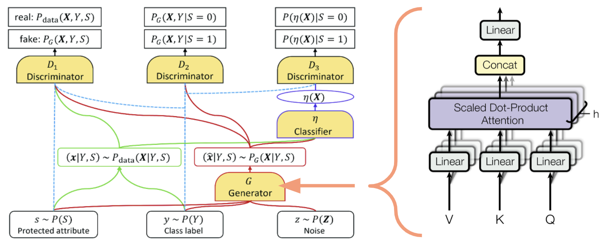

# About
## A 2023 UC Berkeley Capstone project to mitigate racial, gender and other biases in data and machine learning models

To mitigate the potential biases in machine learning models that are increasingly present in our daily lives, we created a model that generates synthetic training data. Our approach advances the state-of-the-art FairGAN+ by incorporating a transformer architecture, resulting in more accurate and fairer data generation. These modifications have the potential to improve the quality and equity of synthetic data, which is crucial in various applications, such as data augmentation and privacy-preserving machine learning.

{: .highlight }
### Model Architecture
Fairness and accuracy are critical factors in generating high-quality synthetic data for various applications in machine learning. To address these challenges, we made several modifications to the generator architecture of FairGAN+. We added support for data with multi-class protected attributes (ex: race, nationality, political party, etc.). Furthermore, we implemented a transformer into the model as can be seen in the diagram below. We were able to generate more accurate and fair synthetic data across the various datasets we tested on.

### Generative Adversarial Network
A Generative Adversarial Network (GAN) consists of a 2 neural networks, a generator and discriminator. The generator is trying to generate real-looking data, and discriminator is trying to discriminate between the real and generated data. The generator and discriminator are playing an adversarial game.
As seen in the diagram below, there are 3 discriminators in our model - 1 of them focuses on generated data integrity (D1) and 2 of them focus on generated data fairness (D2, D3).

### Transformer
We integrated a transformer into the original generator architecture to capture the collinearity relationship between the features, outcome variable, and protected attribute. The attention mechanism is applied to the output of the FairGAN+ generator encoder to generate contextualized embeddings. These embeddings are then fed into the FairGAN+ generator decoder to produce continuous-value synthetic data.

{: .highlight }
### Aknowledgements
We would like to acknowledge the influential work of Depeng Xu, Shuhan Yuan, Lu Zhang, and Xintao Wu from the University of Arkansas, whose research on [FairGAN+: Achieving Fair Data Generation and Classification through Generative Adversarial Nets] greatly influenced our project.

[FairGAN+: Achieving Fair Data Generation and Classification through Generative Adversarial Nets]: https://ieeexplore.ieee.org/abstract/document/9006322?casa_token=rtdWVzSgLKoAAAAA:AMi_jcLYpcU-evETPjOU7z-NF7W6NVOBczeq01sPpEIzl8V_XcwMYeTqabxFM2AOwCYt2VA
